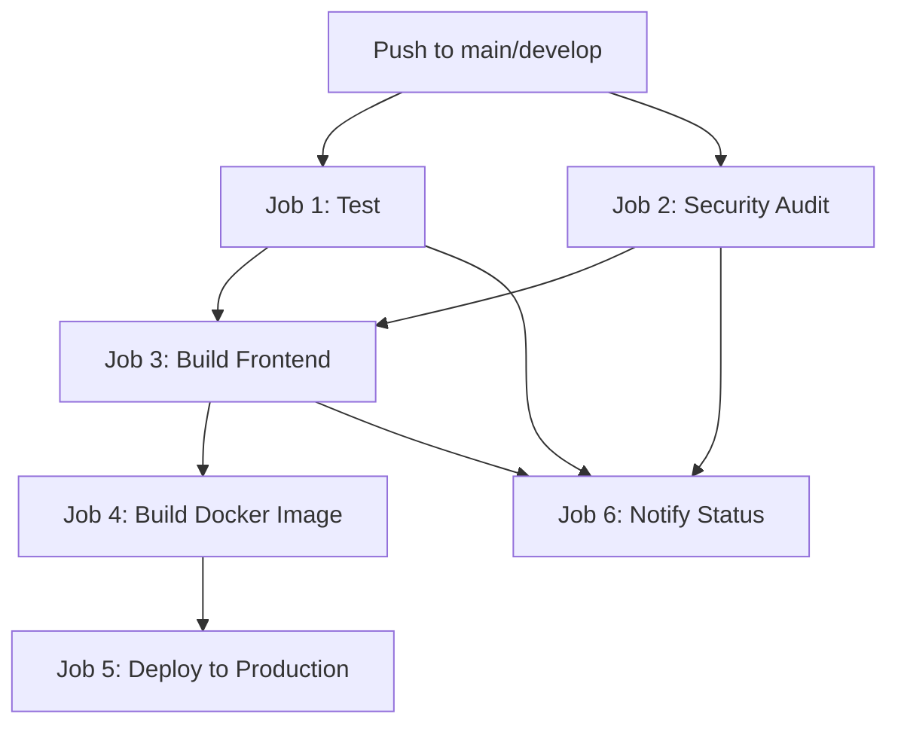

# CI/CD Pipeline Setup Guide

Complete guide for setting up and using the GitHub Actions CI/CD pipeline.

## Table of Contents

1. [Overview](#overview)
2. [Pipeline Architecture](#pipeline-architecture)
3. [Initial Setup](#initial-setup)
4. [GitHub Secrets Configuration](#github-secrets-configuration)
5. [Pipeline Jobs Explained](#pipeline-jobs-explained)
6. [Customizing Deployment](#customizing-deployment)
7. [Monitoring Pipeline](#monitoring-pipeline)
8. [Troubleshooting](#troubleshooting)
9. [Advanced Configuration](#advanced-configuration)

---

## Overview

The CI/CD pipeline automates:
- ✅ Running tests on every push
- ✅ Security vulnerability scanning
- ✅ Building production frontend
- ✅ Creating Docker images
- ✅ Deploying to production
- ✅ Notifying team of failures

**Triggers:**
- Push to `main` or `develop` branches
- Pull requests to `main` or `develop`

**Time:** ~5-8 minutes per run

---

## Pipeline Architecture



**Parallel Jobs:**
- Test and Security Audit run simultaneously
- Build waits for both to complete
- Docker build runs only on main branch
- Deployment runs only after Docker build

---

## Initial Setup

### 1. Push Pipeline File

The pipeline file is already created at `.github/workflows/ci.yml`

```bash
# Verify file exists
ls -la .github/workflows/ci.yml

# Commit and push
git add .github/workflows/ci.yml
git commit -m "feat: Add CI/CD pipeline with GitHub Actions"
git push origin main
```

### 2. Verify Pipeline Runs

1. Go to your GitHub repository
2. Click **Actions** tab
3. You should see "CI/CD Pipeline" workflow
4. First run will start automatically

---

## GitHub Secrets Configuration

### Required Secrets (for Docker deployment)

Navigate to: **GitHub repo → Settings → Secrets and variables → Actions → New repository secret**

#### 1. `DOCKER_USERNAME`
- **What**: Your Docker Hub username
- **Example**: `johnsmith`
- **Get it**: https://hub.docker.com → Account Settings

#### 2. `DOCKER_PASSWORD`
- **What**: Docker Hub access token (NOT your password!)
- **Get it**:
  1. Login to Docker Hub
  2. Account Settings → Security
  3. Click "New Access Token"
  4. Name: "GitHub Actions"
  5. Permissions: Read, Write, Delete
  6. Copy token immediately (only shown once)

**Add Secret:**
```
Name: DOCKER_PASSWORD
Value: dckr_pat_abcd1234...
```

### Optional Secrets (for production deployment)

#### 3. `PRODUCTION_HOST`
- **What**: Your production server IP or domain
- **Example**: `123.45.67.89` or `app.yourdomain.com`
- **When needed**: If deploying via SSH

#### 4. `PRODUCTION_USER`
- **What**: SSH username for production server
- **Example**: `ubuntu`, `root`, or `deployer`

#### 5. `PRODUCTION_SSH_KEY`
- **What**: Private SSH key for accessing production server
- **Get it**:
  ```bash
  # On your local machine
  cat ~/.ssh/id_rsa
  # Copy the entire output including BEGIN/END lines
  ```

#### 6. `SLACK_WEBHOOK` (Optional)
- **What**: Slack webhook URL for notifications
- **Get it**: Slack → Apps → Incoming Webhooks

---

## Pipeline Jobs Explained

### Job 1: Lint and Test

**What it does:**
- Checks out code
- Installs Node.js 20
- Installs dependencies
- Runs linter (if configured)
- Runs all tests
- Uploads coverage report

**Configuration:**
```yaml
test:
  runs-on: ubuntu-latest
  steps:
    - uses: actions/checkout@v4
    - uses: actions/setup-node@v4
      with:
        node-version: '20'
        cache: 'npm'
    - run: npm ci
    - run: npm run lint || echo "Linter not configured"
      continue-on-error: true
    - run: npm run test:run
    - uses: actions/upload-artifact@v4
      with:
        name: coverage-report
        path: coverage/
```

**When it fails:**
- Tests are failing
- Dependencies can't be installed
- package.json or package-lock.json is corrupted

---

### Job 2: Security Audit

**What it does:**
- Runs `npm audit` to check for vulnerabilities
- Runs custom security testing script (if exists)

**Configuration:**
```yaml
security:
  runs-on: ubuntu-latest
  steps:
    - uses: actions/checkout@v4
    - uses: actions/setup-node@v4
      with:
        node-version: '20'
    - run: npm audit --audit-level=moderate
      continue-on-error: true
    - run: |
        if [ -f "./test-security.sh" ]; then
          chmod +x ./test-security.sh
          ./test-security.sh
        fi
```

**Audit Levels:**
- `low`: Report all vulnerabilities
- `moderate`: Fail on moderate+ vulnerabilities (current)
- `high`: Fail only on high/critical
- `critical`: Fail only on critical

**When it fails:**
- Dependencies have known vulnerabilities
- Fix: `npm audit fix` or update packages

---

### Job 3: Build Frontend

**What it does:**
- Builds production frontend with Vite
- Uploads build artifacts
- Verifies build succeeded

**Configuration:**
```yaml
build:
  runs-on: ubuntu-latest
  needs: [test]  # Waits for tests to pass
  steps:
    - uses: actions/checkout@v4
    - uses: actions/setup-node@v4
    - run: npm ci
    - run: npm run build
      env:
        NODE_ENV: production
    - uses: actions/upload-artifact@v4
      with:
        name: dist
        path: dist/
```

**When it fails:**
- Build errors in frontend code
- Missing environment variables
- TypeScript errors
- Import errors

**Debug:**
```bash
# Test build locally
npm run build

# Check for errors
echo $?  # Should output 0
```

---

### Job 4: Build Docker Image

**What it does:**
- Builds Docker image from Dockerfile
- Tags image with branch name and SHA
- Pushes to Docker Hub
- **Only runs on main branch pushes**

**Configuration:**
```yaml
docker:
  runs-on: ubuntu-latest
  needs: [test, security, build]
  if: github.ref == 'refs/heads/main'  # Main branch only
  steps:
    - uses: actions/checkout@v4
    - uses: docker/setup-buildx-action@v3
    - uses: docker/login-action@v3
      with:
        username: ${{ secrets.DOCKER_USERNAME }}
        password: ${{ secrets.DOCKER_PASSWORD }}
    - uses: docker/build-push-action@v5
      with:
        context: .
        push: true
        tags: |
          ${{ secrets.DOCKER_USERNAME }}/ecommerce-template:latest
          ${{ secrets.DOCKER_USERNAME }}/ecommerce-template:${{ github.sha }}
```

**Image Tags Created:**
- `latest`: Always points to most recent main branch build
- `main-abc123`: Tagged with git commit SHA
- `main`: Tagged with branch name

**When it fails:**
- Docker Hub credentials invalid
- Dockerfile syntax errors
- Build context too large

**Debug:**
```bash
# Test Docker build locally
docker build -t test-image .

# Check image size
docker images test-image
```

---

### Job 5: Deploy to Production

**What it does:**
- Deploys to production server
- **Only runs on main branch pushes**
- **Only runs after Docker build succeeds**
- Currently shows deployment options (needs customization)

**Configuration:**
```yaml
deploy:
  runs-on: ubuntu-latest
  needs: [docker]
  if: github.ref == 'refs/heads/main'
  environment:
    name: production
    url: https://your-production-url.com
  steps:
    - name: Deploy to production
      run: echo "Configure deployment here"
```

**See [Customizing Deployment](#customizing-deployment) section below.**

---

### Job 6: Notify Status

**What it does:**
- Runs after test, security, and build jobs
- Checks if any job failed
- Can send notifications (Slack, email, etc.)

**Configuration:**
```yaml
notify:
  runs-on: ubuntu-latest
  needs: [test, security, build]
  if: always()  # Runs even if previous jobs fail
  steps:
    - name: Check workflow status
      run: |
        if [ "${{ needs.test.result }}" == "failure" ] || \
           [ "${{ needs.security.result }}" == "failure" ] || \
           [ "${{ needs.build.result }}" == "failure" ]; then
          echo "❌ Workflow failed"
          exit 1
        else
          echo "✅ Workflow succeeded"
        fi
```

---

## Customizing Deployment

### Option 1: Deploy via SSH (DigitalOcean, AWS EC2, Custom VPS)

**Setup:**

1. **Add secrets** (see [GitHub Secrets](#github-secrets-configuration)):
   - `PRODUCTION_HOST`
   - `PRODUCTION_USER`
   - `PRODUCTION_SSH_KEY`

2. **Update deploy job** in `.github/workflows/ci.yml`:

```yaml
deploy:
  name: Deploy to Production
  runs-on: ubuntu-latest
  needs: [docker]
  if: github.ref == 'refs/heads/main'

  steps:
    - name: Deploy via SSH
      uses: appleboy/ssh-action@v1.0.0
      with:
        host: ${{ secrets.PRODUCTION_HOST }}
        username: ${{ secrets.PRODUCTION_USER }}
        key: ${{ secrets.PRODUCTION_SSH_KEY }}
        script: |
          cd /opt/ecommerce
          docker-compose pull
          docker-compose up -d
          docker system prune -f
```

**Server Preparation:**
```bash
# On production server
sudo mkdir -p /opt/ecommerce
cd /opt/ecommerce

# Copy docker-compose.yml and .env
scp docker-compose.yml user@server:/opt/ecommerce/
scp .env user@server:/opt/ecommerce/

# Ensure Docker is installed
docker --version
docker-compose --version
```

---

### Option 2: Deploy to Vercel

**Setup:**

1. **Install Vercel CLI** (locally):
   ```bash
   npm install -g vercel
   vercel login
   ```

2. **Get Vercel token**:
   ```bash
   vercel token
   ```

3. **Add secrets**:
   - `VERCEL_TOKEN`: Token from step 2
   - `VERCEL_ORG_ID`: Get from `.vercel/project.json` after first deploy
   - `VERCEL_PROJECT_ID`: Get from `.vercel/project.json`

4. **Update deploy job**:

```yaml
deploy:
  name: Deploy to Vercel
  runs-on: ubuntu-latest
  needs: [build]
  if: github.ref == 'refs/heads/main'

  steps:
    - uses: actions/checkout@v4
    - uses: actions/setup-node@v4
      with:
        node-version: '20'

    - name: Install Vercel CLI
      run: npm install -g vercel

    - name: Deploy to Vercel
      run: vercel deploy --prod --token=${{ secrets.VERCEL_TOKEN }}
      env:
        VERCEL_ORG_ID: ${{ secrets.VERCEL_ORG_ID }}
        VERCEL_PROJECT_ID: ${{ secrets.VERCEL_PROJECT_ID }}
```

---

### Option 3: Deploy to Heroku

**Setup:**

1. **Add secrets**:
   - `HEROKU_API_KEY`: Get from Heroku Account Settings
   - `HEROKU_APP_NAME`: Your app name (e.g., `my-ecommerce-app`)

2. **Update deploy job**:

```yaml
deploy:
  name: Deploy to Heroku
  runs-on: ubuntu-latest
  needs: [build]
  if: github.ref == 'refs/heads/main'

  steps:
    - uses: actions/checkout@v4
    - uses: akhileshns/heroku-deploy@v3.12.14
      with:
        heroku_api_key: ${{ secrets.HEROKU_API_KEY }}
        heroku_app_name: ${{ secrets.HEROKU_APP_NAME }}
        heroku_email: ${{ secrets.HEROKU_EMAIL }}
```

---

### Option 4: Deploy to AWS ECS

**Setup:**

1. **Add secrets**:
   - `AWS_ACCESS_KEY_ID`
   - `AWS_SECRET_ACCESS_KEY`
   - `AWS_REGION`

2. **Update deploy job**:

```yaml
deploy:
  name: Deploy to AWS ECS
  runs-on: ubuntu-latest
  needs: [docker]
  if: github.ref == 'refs/heads/main'

  steps:
    - uses: actions/checkout@v4

    - name: Configure AWS credentials
      uses: aws-actions/configure-aws-credentials@v4
      with:
        aws-access-key-id: ${{ secrets.AWS_ACCESS_KEY_ID }}
        aws-secret-access-key: ${{ secrets.AWS_SECRET_ACCESS_KEY }}
        aws-region: ${{ secrets.AWS_REGION }}

    - name: Deploy to ECS
      run: |
        aws ecs update-service \
          --cluster ecommerce-cluster \
          --service ecommerce-service \
          --force-new-deployment
```

---

## Monitoring Pipeline

### View Pipeline Status

**GitHub UI:**
1. Go to repository → **Actions** tab
2. See all workflow runs
3. Click on run to see details
4. Click on job to see logs

**Badges:**

Add to `README.md`:
```markdown

```

### Understanding Results

**✅ Green checkmark**: All jobs passed
**❌ Red X**: At least one job failed
**🟡 Yellow circle**: Pipeline is running
**⚫ Gray circle**: Pipeline skipped/cancelled

### Email Notifications

GitHub automatically emails you when:
- Pipeline fails on main branch
- Pipeline succeeds after previous failure

**Configure:**
- GitHub → Settings → Notifications
- Enable "Actions" notifications

---

## Troubleshooting

### Tests Failing in CI but Pass Locally

**Cause**: Environment differences

**Solution:**
```yaml
# Add environment variables to test job
test:
  env:
    CI: true
    NODE_ENV: test
```

**Debug locally:**
```bash
CI=true npm run test:run
```

---

### Docker Build Fails: "No space left on device"

**Cause**: GitHub Actions runner out of disk space

**Solution:**

Add cleanup step before Docker build:
```yaml
- name: Free disk space
  run: |
    docker system prune -af
    sudo rm -rf /usr/local/lib/android
    sudo rm -rf /usr/share/dotnet
```

---

### "Error: Docker login failed"

**Cause**: Invalid Docker Hub credentials

**Solutions:**

1. **Verify secrets exist:**
   - GitHub repo → Settings → Secrets
   - Check `DOCKER_USERNAME` and `DOCKER_PASSWORD`

2. **Generate new token:**
   - Docker Hub → Account Settings → Security
   - Create new access token
   - Update `DOCKER_PASSWORD` secret

3. **Test locally:**
   ```bash
   echo $DOCKER_PASSWORD | docker login -u $DOCKER_USERNAME --password-stdin
   ```

---

### "npm ci" Fails with Lock File Error

**Cause**: `package-lock.json` out of sync

**Solution:**
```bash
# Regenerate lock file
rm package-lock.json
npm install
git add package-lock.json
git commit -m "fix: Regenerate package-lock.json"
git push
```

---

### Pipeline Hangs on Tests

**Cause**: Tests waiting for input or async operations not completing

**Solution:**

Add timeout:
```yaml
test:
  steps:
    - run: npm run test:run
      timeout-minutes: 10  # Fail after 10 minutes
```

**Debug locally:**
```bash
# Run tests with timeout
timeout 60 npm run test:run
```

---

### Deploy Job Skipped

**Cause**: Runs only on `main` branch

**Check:**
```bash
# View current branch
git branch

# Should be on main
git checkout main
git push origin main
```

---

### "Error: Resource not accessible by integration"

**Cause**: Workflow doesn't have permission to perform action

**Solution:**

Add permissions to workflow:
```yaml
name: CI/CD Pipeline

on: [push, pull_request]

permissions:
  contents: read
  packages: write
  actions: read

jobs:
  # ...
```

---

## Advanced Configuration

### Caching Dependencies

Speed up pipeline by caching node_modules:

```yaml
test:
  steps:
    - uses: actions/setup-node@v4
      with:
        node-version: '20'
        cache: 'npm'  # Automatically caches npm dependencies
```

**Result**: 30-60 second faster runs

---

### Matrix Testing (Multiple Node Versions)

Test on multiple Node.js versions:

```yaml
test:
  runs-on: ubuntu-latest
  strategy:
    matrix:
      node-version: [18, 20, 21]
  steps:
    - uses: actions/setup-node@v4
      with:
        node-version: ${{ matrix.node-version }}
    - run: npm ci
    - run: npm run test:run
```

**Result**: Tests run on Node 18, 20, and 21 in parallel

---

### Deploy to Multiple Environments

Deploy to staging and production:

```yaml
deploy-staging:
  if: github.ref == 'refs/heads/develop'
  environment:
    name: staging
    url: https://staging.yourdomain.com
  steps:
    # Deploy to staging

deploy-production:
  if: github.ref == 'refs/heads/main'
  environment:
    name: production
    url: https://yourdomain.com
  steps:
    # Deploy to production
```

---

### Manual Approval for Deployment

Require manual approval before deploying:

1. **Configure environment protection:**
   - GitHub repo → Settings → Environments
   - Click "production"
   - Enable "Required reviewers"
   - Add team members

2. **Use environment in deploy job:**
```yaml
deploy:
  environment:
    name: production  # Requires approval
```

**Result**: Pipeline pauses before deploy, waiting for approval

---

### Slack Notifications

Get notified in Slack when pipeline completes:

1. **Create Slack webhook:**
   - Slack → Apps → Incoming Webhooks
   - Add to workspace
   - Copy webhook URL

2. **Add secret:**
   - GitHub → Settings → Secrets
   - Add `SLACK_WEBHOOK`

3. **Add notification step:**
```yaml
notify:
  needs: [test, security, build]
  if: always()
  steps:
    - name: Slack notification
      uses: 8398a7/action-slack@v3
      with:
        status: ${{ job.status }}
        text: 'CI/CD Pipeline completed'
        webhook_url: ${{ secrets.SLACK_WEBHOOK }}
      if: always()
```

---

### Conditional Jobs

Run jobs only when specific files change:

```yaml
test-frontend:
  runs-on: ubuntu-latest
  if: contains(github.event.commits[0].modified, 'src/')
  steps:
    - run: npm run test:run

test-backend:
  runs-on: ubuntu-latest
  if: contains(github.event.commits[0].modified, 'server.js')
  steps:
    - run: npm run test:backend
```

---

## Pipeline Best Practices

### 1. Keep Pipelines Fast
- ✅ Use caching
- ✅ Run jobs in parallel
- ✅ Only run necessary steps
- ❌ Don't run full builds on PR branches

### 2. Fail Fast
- ✅ Run tests before expensive operations
- ✅ Add timeouts to prevent hanging
- ✅ Use `continue-on-error: false` for critical steps

### 3. Security
- ✅ Never commit secrets to code
- ✅ Use GitHub Secrets for credentials
- ✅ Limit permissions to minimum required
- ✅ Use short-lived tokens

### 4. Debugging
- ✅ Add descriptive step names
- ✅ Echo important variables (never secrets!)
- ✅ Use `actions/upload-artifact` to save logs

### 5. Cost Management
- ✅ GitHub Actions is free for public repos
- ✅ Private repos get 2,000 minutes/month free
- ✅ Use caching to reduce build times
- ✅ Only run expensive jobs on main branch

---

## Summary

**What You Get:**
- Automated testing on every push
- Security vulnerability scanning
- Production builds
- Docker image creation
- Automated deployment (once configured)

**Setup Time:**
- Initial: 10 minutes
- Adding deployment: 20-30 minutes (depends on platform)

**Maintenance:**
- Minimal - runs automatically
- Update secrets when rotating credentials
- Adjust jobs as project grows

**Next Steps:**
1. Push pipeline file to GitHub
2. Add Docker Hub secrets
3. Configure deployment for your platform
4. Test by pushing to main branch
5. Monitor Actions tab for results

---

**Last Updated:** January 2025

**Related Documentation:**
- [Docker Setup](../DOCKER.md)
- [Deployment Guide](../DEPLOYMENT.md)
- [Getting Started](../GETTING_STARTED.md)
